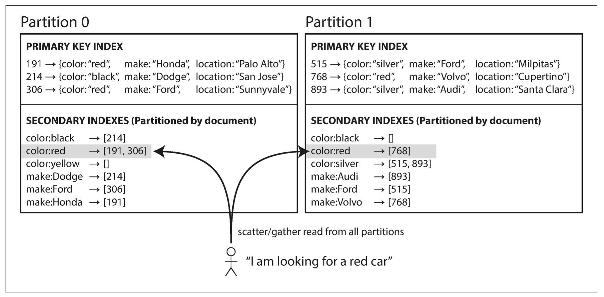

# Designing Data-Intensive Applications

## Part I

### Chapter 1 -

### Chapter 2 - 

### Chapter 3 -

### Chapter 4 -

## Part II

### Chapter 5 Replication

*Replication means keeping a copy of the same data on multiple machines that are connected via a network.There are 
several reasons why you might want to replicate data:*

- *To keep data geographically close to your users (and thus reduce latency)*
- *To allow the system to continue working even if some of its parts have failed (and thus increase availability)*
- *To scale out the number of machines that can serve read queries (and thus increase read throughput)*

#### Leader-based replication
1. *One of the replicas is designated the leader. When clients want to write to the 
database, they must send their requests to the leader, which first writes the new data to its local storage.*
2. *The other replicas are known as followers. Whenever the leader writes new data to its local storage, it also sends 
the data change to all of its followers as part of a replication log 
or change stream.*

##### Synchronous Versus Asynchronous Replication

*The replication to follower 1 is synchronous: the leader waits until follower 1 has confirmed that it received the write 
before reporting success to the user, and before making the write visible to other clients. The replication to follower 
2 is asynchronous: the leader sends the message, but doesn’t wait for a response from the follower.*

The best way is to make one write synchronous and all other asynchronous.
*This guarantees that you have an up-to-date copy of the data on at least two nodes: the leader and one synchronous 
follower. This configuration is sometimes also called semi-synchronous.*

#### Multi-Leader Replication

##### Conflict avoidance
*The simplest strategy for dealing with conflicts is to avoid them: if the application can ensure that all writes for a 
particular record go through the same leader, then con‐ flicts cannot occur. Since many implementations of multi-leader 
replication handle conflicts quite poorly, avoiding conflicts is a frequently recommended approach.*
#### Leaderless Replication

Meaning that any replica allowed to directly accept writes from clients.
Read requests are also sent to several nodes in parallel.
Read-repair approach. If while reading from several nodes some are inconsistent - repair them.

### Chapter 6 Partitioning

Partition == sharding

**Hash partitioning**, hash-function can help to evenly distribute data among all partitions.

**Partitioning Secondary Indexes by document**

Each partition maintains its own secondary indexes, covering only the documents in that partition.

+easy to write

-hard to read(need to check all partitions)

**Partitioning Secondary Indexes by term**

+easy to read

-hard to write(write to a single document may affect multiple partitions)

*updates to global secondary indexes are often asynchronous*

**Rebalancing partitions** -

**Request routing**
